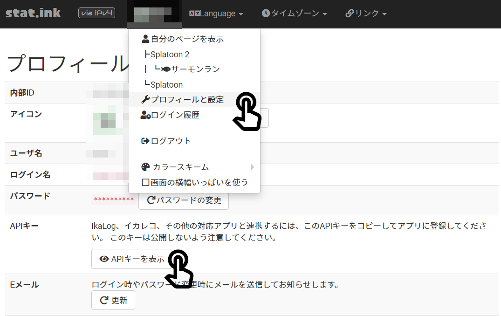

# Discord Bot for Stat.ink X Heroku

PC初心者でも、スマホしかない人でも、**stat.inkにSplatoonの戦績を自動アップロードするdiscord bot**を作れるようにしたいと考え、このscriptを書きました。

- Botの起動からやりたい (Heroku利用・初心者はこちら) -> [#事前準備](#事前準備), [#Bot起動まで](#Bot起動まで)
- Botの起動からやりたい (Heroku以外利用) -> [#事前準備・Bot起動まで(Heroku以外)](#事前準備・Bot起動まで(Heroku以外))
- すでにBotの起動ができている -> [#Botの使い方](#Botの使い方)
- 苦情・要請 -> [#Contact Me](#contact-me)

## 事前準備
### サービスへの登録など
無料でやるために、いくつかのサービスを利用します。アカウントをすでに持っているなら、追加で作成する必要はありません。
以下のstat.inkのAPI KEYやDISCORD BOT TOKENはメモ帳にでもコピーしておいてください。

- stat.ink : アカウント作成、API KEYコピー
- Heroku : アカウント作成、API KEYコピー
    - URL : https://signup.heroku.com/
- discord : アカウント作成、DISCORD BOT TOKENコピー、BOTのserverへの追加
    - 参考 [Discord Botアカウント初期設定ガイド for Developer](https://qiita.com/1ntegrale9/items/cb285053f2fa5d0cccdf)のうち**はじめに~サーバーへの登録**

### heroku API KEY取得

1. アカウントのアイコンマークをクリックし、Account settingsをクリックします。

2. API Keyの欄でRevealをクリックし、表示されたAPI KEYをメモ帳などにコピーしておきます。

### stat.ink API KEY取得

1. stat.inkの自分のアカウントをクリックし、「プロフィールと設定」をクリックします。
2. APIキーの欄で「APIキーを表示」をクリックし、表示されたAPI KEYをメモ帳などにコピーしておきます。

## Bot起動まで
### HerokuへDeploy
1. **あらかじめブラウザまたはアプリのHerokuにログインしておきます。**
2. ↓このボタンをクリックします。

3. しばらく待機します。画面が切り替わらなければページをリロード。
4. app-nameに`app-splat`(他の名前でもよい)を入力して
    - PC : `Deploy app`をクリックし、しばらく待機してDeployが完了したら`Manage App`をクリック。
    - スマホ : `Create app`をクリックする。

### 環境変数の登録 (API KEY、TOKENなど)

続けて、環境変数としてTOKENなどを登録します。
1. Setting</img> の中のConfig Varsの欄へ。
2. Reveal Config Varsをクリックして、以下の環境変数を入力していきます。  
   KEYとVALUEを1組入力するごとに`Add`をクリックします。  

|KEY|VALUE|
|-|-|
|DISCORD_BOT_TOKEN|コピーしておいたDISCORD BOT TOKEN|
|HEROKU_APP_NAME|HEROKUのapp-name。デフォルトのままなら`app-splat`|
|HEROKU_APIKEY|コピーしておいたHEROKUのAPI KEY|

### Botを起動

メニューの欄のResources</img>へ。
1. 鉛筆マーク</img>をクリックし、バー</img>を右にスライドして青く</img>なればOK。
2. `Confirm`をクリックすれば、しばらくするとDiscord Botが起動します。

Botのいるサーバーで`?help`と入力してBotから反応があれば起動完了です。

## 事前準備・Bot起動まで(Heroku以外)
GCPなどHeroku以外のサービスでDiscord Botを利用する方法を解説します。ある程度初心者でないことを想定して、こちらの解説は簡単にしています。

### 事前準備
- stat.ink : アカウント作成、API KEYコピー
- discord : アカウント作成、DISCORD BOT TOKENコピー、BOTのserverへの追加
    - 参考 [Discord Botアカウント初期設定ガイド for Developer](https://qiita.com/1ntegrale9/items/cb285053f2fa5d0cccdf)のうち**はじめに~サーバーへの登録**

### Bot起動まで
`git clone`などでダウンロードし、`pip3 install -r requirements.txt`で必要なライブラリをインストールします。最後に`python3 src/main.py`でdiscord botを起動します。terminalにエラーメッセージが出なければ大丈夫です。`screen`は必要に応じて利用してください。

## Botの使い方
### BotへのNintendoアカウント登録
`?startIksm <STATINK_API_KEY>`
1. stat.inkのAPI KEYを用意しておきます。
2. botとのDMなどで`?startIksm <STATINK_API_KEY>`のように、`?startIksm`に続けてAPI KEYを入力して送信します。
(**botと同じサーバーに加入していれば、アカウントの設定にもよりますが、そのbotとDMを行うことが可能です。**)

> ※注意
**API KEYやTOKENなどと呼ばれるものは、すべてアカウント名とパスワードのセットと等価です。他人にばれることはとても危険なことです。**
家族やごく親しい友人しかいないサーバーでは大丈夫かもしれませんが、できるだけbotとのDMで`?startIksm`は行ってください。

3. すると、botからURLが送られてくるのでそのリンクをタップします。

4. リンク先でログインすると、連携アカウントの選択画面になるので、
**「この人にする」を右クリック(スマホなら長押し)して、リンク先のURLをコピーします。**

5. discordに戻り、コピーしたリンクを貼り付け、少し待つと`新たにアカウントが登録されました。`と表示されます。

ここまでできれば、戦績の定期アップロードは自動で15分ごとに行われます。(毎時00/15/30/45分です。)
お疲れ様です。

### 各種コマンド
`?help Splat`とBotに入力することでも確認できます。

|コマンド|引数|説明|
|-|-|-|
|`?startIksm`|STAT_INK_API_KEY| 新たにiksm_sessionを取得し、botにアカウントを登録します。 事前にstat.inkの登録を完了し、API KEYを取得しておいてください。|
|`?checkIksmSession`|acc_name|指定されたアカウントのiksm_sessionを表示します。|
|`?changeAPI`|acc_name, NEW_API_KEY|指定されたアカウントのstat.inkのAPI KEYを変更します。|
|`?rmIksm`|acc_name|指定されたアカウントの情報を削除します。|
|`?showIksmAcc`|なし|登録されているnintendoアカウント一覧を表示します。|

## Botがうまく動かない

よく分からないかもしれませんが、logを確認しましょう。  
Herokuを開いて、Open appの横のMore->view logsをクリック。そこで表示されるlogから原因を探ってください。

## 適当な解説

### 戦績保存アプリ
Splatoon2の戦績は公式のNintendo Onlineアプリから確認できますが、最新の50戦以外は確認できず統計的な利用もできません。  
その戦績データを外部に保存しようという試みはいくつかあります。(stat.ink, ikaWidget2, ikaLogなど)  
しかしそれらに自動で定期的に戦績をアップロードする機能は含まれておらず、アップロードする前に50戦してしまうと、その間の戦績が失われてしまいます。  

### splatnet2statink

splatnet2statinkは戦績をstat.inkに自動でアップロードしてくれるPythonファイルです。  
これを定期的に実行することができれば、問題はほとんど解決です。  
しかし、無料でオンラインでプログラムを実行し続けることなんてできるのでしょうか?

### Heroku

できます。無料のものに限ってもGCPやHerokuなどの選択肢があるのですが、
今回はPC初心者向けということでHerokuを選びました。  
HerokuならPCなしでもできます。(大学生以上の方などでLinuxに苦手感がないなら、GCPの方が使い勝手はいいです。)  

### iksm_session

では、最後の関門です。  
Splatoon2のデータを取り扱うには、はじめにiksm_session(イカスミsession)と呼ばれる文字列を取得する必要があります。  
これはPCでbash系、あるいはPowerShellなどを動かせるなら大した問題ではないのですが、
不慣れな人にとっては十分に大きな問題でしょう。  

そこで、今回のdiscord botではこれも解決しました。  
discord botとのchatでどうにかできます。(詳しくは使い方を参照。)

## Botを自分好みに改造したくなったら
[Discord Bot 最速チュートリアル【Python&Heroku&GitHub】](https://qiita.com/1ntegrale9/items/aa4b373e8895273875a8#8-dynos%E3%81%AE%E8%A8%AD%E5%AE%9A)を参考にしてください。  

## Reference
- [Discord Bot 最速チュートリアル【Python&Heroku&GitHub】](https://qiita.com/1ntegrale9/items/aa4b373e8895273875a8#8-dynos%E3%81%AE%E8%A8%AD%E5%AE%9A)
- [Discord Botアカウント初期設定ガイド for Developer](https://qiita.com/1ntegrale9/items/cb285053f2fa5d0cccdf)
- [frozenpandaman/splatnet2statink](https://github.com/frozenpandaman/splatnet2statink)

## Contact Me

[TomoTom0](https://github.com/TomoTom0)

## LICENSE
MIT